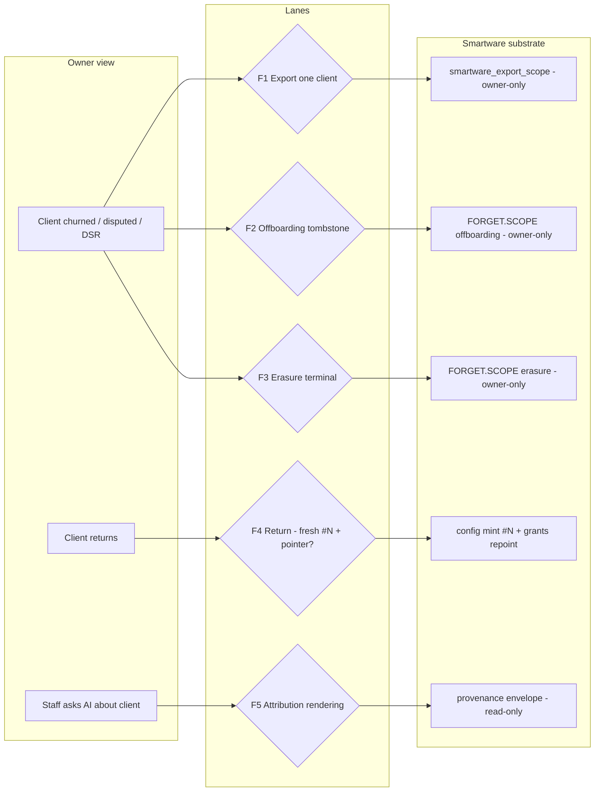
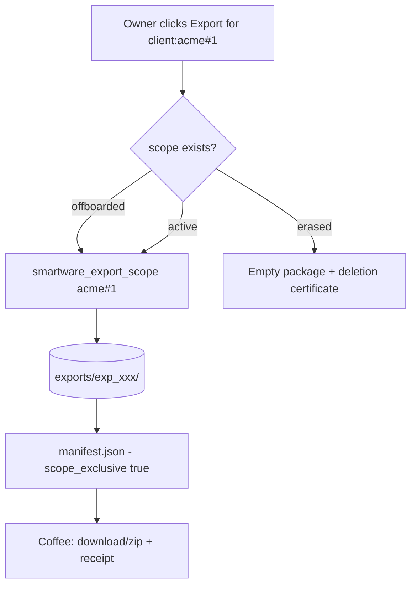
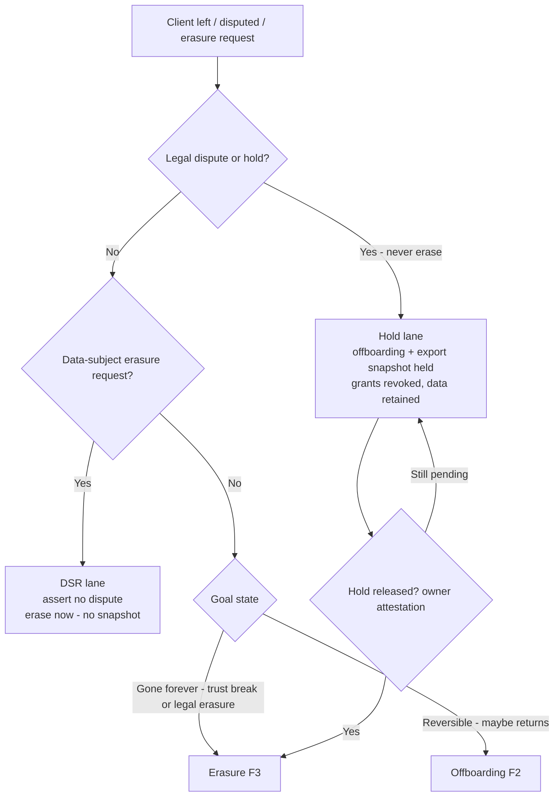
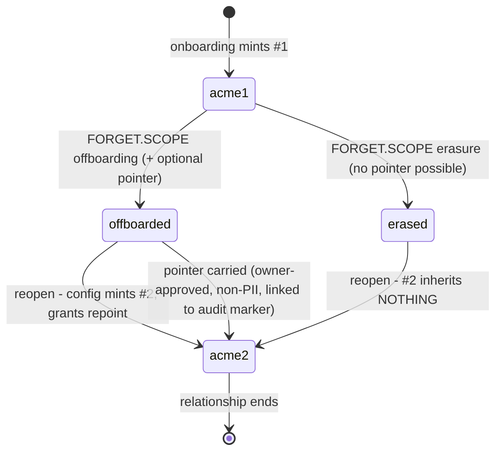

# Coffee client-scope flows — erasure · offboarding · export · return · attribution

**Status:** FLOWS DESIGNED (G3, 2026-08-29); F1 substrate SHIPPED (G3.1 — `smartware_export_scope`). Source of truth: `mem0-substrate-spec-draft.md` §10c (v0.12 NORMATIVE) — this doc is the UX/visual companion + slotting matrix.
**Dates:** @user decision (plan G3: "no dates until Coffee's window is known"). Nothing below asserts a date; §6 is the decision surface.

---

## 1. Decision summary

| # | Flow | Substrate state | Coffee state |
|---|------|-----------------|--------------|
| F1 | Export one client ("everything about Acme" = one scope) | **SHIPPED** (G3.1) — `smartware_export_scope` (owner-only, canonical package + manifest, idempotent) | designed (download/receipt UX) |
| F2 | Offboarding (reversible tombstone) | **SHIPPED** v0.5.0 (incl. `owner_pointer` on offboarding) | designed (owner gate + receipt) |
| F3 | Erasure (client left / disputed / legal) | **SHIPPED** v0.5.0 (terminal, lane-exhaustive purge, deletion-certificate audit) | designed (attestation + snapshot step) |
| F4 | Return (fresh `#N` + optional owner-approved pointer) | config-provisioned (no op) + pointer read from audit marker | designed (review-and-seed flow) |
| F5 | Staff-facing attribution rendering | provenance SHIPPED (§7) | designed (product rule §10 + §10c.6) |

**Three binding rules that shape all flows:**
1. **Erasure never runs under dispute** — a legal/dispute trigger takes the hold lane (offboarding + export snapshot); erasure only after owner attestation (the snapshot is the defense record; erasure deletes the evidence).
2. **Export-before-erasure is the default** (the export is both the defensible record and the client's own data-rights copy); the DSR lane (client data-subject request) skips the snapshot and the audit marker IS the deletion certificate.
3. **Owner-only by construction** — FORGET.SCOPE + export are owner-gated in the substrate; staff sees no affordance. Staff/agents are read-side (observe/query/read/correct) within their exact client-scope ids.

---

## 2. Flow map

---

## 3. F1 — Export one client

**Owner trigger:** "Export everything about Acme" (migration prep, audit, dispute prep, or owner-mediated client data-rights request).

**What's in the package** (canonical records only; derived indexes excluded — they regenerate):

| File | Content | Notes |
|------|---------|-------|
| `observations.jsonl` | all observations with `scope = acme#1` (any status) | canonical shape, one record/line |
| `claims.jsonl` | every claim version (incl. forgotten/tombstoned) | history is portable |
| `evidence.jsonl` | evidence items referenced by those claims | `supporting_evidence` id closure |
| `operations.jsonl` | ops entries in the operation closure + `forget.scope` audits for acme#1 | no client content beyond ids / non-PII pointer |
| `entities.jsonl` | entity rows for the scope | **non-canonical projection** — importer MUST re-resolve |
| `manifest.json` | protocol + schema pins, export_id, scope, exported_at, actor, per-file sha256 + aggregate | asserts `scope_exclusive: true` |

**One scope = exactly one boundary.** No record from any other client scope, ever. The manifest asserts it per-source; the G4 import test proves it by re-import equivalence.

**Edge cases:**
- **Post-erasure export** → empty package + deletion certificate reference (marker id + op id) — proof-of-erasure is portable.
- **Data-rights request (client-initiated):** client asks → Coffee notifies owner → owner runs F1 (or declines, logged) → package delivered per the business's retention policy. V1 is owner-mediated; self-service intake is a Coffee-window decision (§6).
- **Portability is forward-safe:** the format is chosen FOR import. The G4 import verb must pass: fresh Pod ← export → per-file counts equal + scope-visible recall equivalence (modulo entity re-resolution). No import verb ships before that test exists.

---

## 4. F2/F3 — Offboarding and erasure (decision tree)

### F2 — Offboarding (reversible tombstone)

| Step | Owner action | Substrate | Outcome |
|------|--------------|-----------|---------|
| 1 | Owner gate (verify identity) | `requireOwner` | staff can't reach it |
| 2 | Optional non-PII pointer (typed fields only) | user input | pointer persists in the offboarding audit marker (pod scope, private) |
| 3 | Confirm (states: reversible, grants revoked) | `FORGET.SCOPE{reason:offboarding}` | tombstone + one ops entry + exact counts (`claims_retracted`, `observations_retracted`, `grants_revoked`) |
| 4 | Receipt rendered | ops entry | operation_id, counts, timestamp; grants revoked same commit |

After offboarding: client scope data is out of recall (zero results), grants revoked, but data retained and the scope entry stays. Searches return nothing; the audit trail explains it.

### F3 — Erasure (terminal)

| Step | Owner action | Substrate | Outcome |
|------|--------------|-----------|---------|
| 1 | Owner gate | `requireOwner` | — |
| 2 | Attestation: "no pending dispute / request verified / hold released" | recorded in the ops entry | the evidence-for-the-dispute went through the hold lane instead |
| 3 | Snapshot? (default YES; DSR lane: NO) | `smartware_export_scope` | export_id linked in the erasure ops entry |
| 4 | Confirm irreversible (client left permanently; no legal right retained) | `FORGET.SCOPE{reason:erasure}` | physical purge every lane; scope entry removed; `#1` permanently retired |
| 5 | Receipt = **deletion certificate** | audit marker (operation_id + exact counts + hash chain) | owner can produce proof-of-erasure forever |

**Post-erasure facts (verified by conformance t_58b66030):** zero recall results in every lane *and against a rebuilt index*; `#1` marker non-reusable; a returning client gets `#2` and inherits nothing.

### Why erasure never fires under dispute
Erasure deletes the evidence needed to defend. The hold lane keeps the data (tombstoned, out of recall, grants revoked) and holds the snapshot. When the hold releases (owner attestation), erasure runs — or the business re-engages via F4.

---

## 5. F4 — Return (fresh `#N` + optional owner-approved pointer)

| Step | Owner action | Substrate | Rule |
|------|--------------|-----------|------|
| 1 | "Client returned" | config mint `client:<id>#N` (N = max #n + 1) | no protocol op; #N inherits nothing; structural distinctness (grant on #2 never authorizes #1) |
| 2 | Grants repointed | config edit (exact-id lists per §10b.2) | staff re-listed on #N explicitly |
| 3 | Pointer review | read offboarding audit marker (`content.body.owner_pointer`) | **never automatic** — the old pointer is a suggestion, owner reviews/edits |
| 4 | Seed pointer | owner OBSERVE into #N, `provenance.parent_ids = [marker id]`, `context = 'client-return-pointer'` | audited, labeled "carried from offboarding ⟨op⟩ ⟨date⟩ — owner-approved ⟨ts⟩" |
| 5 | Post-erasure return | nothing to show | UI states "no prior history — erased ⟨op⟩ ⟨date⟩" |

**Pointer content — non-PII categorical ONLY (binding):**
- relationship length ("client since 2023")
- job categories + count ("4 jobs: bookkeeping, tax, payroll")
- satisfaction summary ("positive, no disputes")
- contact-free channel preference
- **NEVER:** contact data, addresses, phone, email, documents, raw conversation text, descriptive free-text PII. The Coffee pointer builder is typed fields only; the substrate enforces scope, Coffee enforces content rules.

---

## 6. F5 — Attribution rendering (staff-facing only)

**Never client-facing.** "Maya said" is a loyalty liability — client-facing UI never shows sources.

| Case | Default | Reason shown |
|------|---------|--------------|
| Correction / revise / conflict / superseded | **ON** | "corrected ⟨date⟩" |
| Freshness ≠ EXTRACTED (raw `unverified` or FAILED) | **ON** | "from raw evidence — not yet verified" |
| version_at ≤ 14d | **ON** | "learned from ⟨source type⟩ ⟨date⟩" |
| everything else | OFF + "Why this answer?" toggle | one-line reason |

Render shape: `learned from ⟨source type⟩ ⟨date⟩; corrected ⟨date⟩` + one line (freshness / correction / conflict). The ≤14d recency is presentation-level only — searchability freshness stays state-based (§10a), so the two rules never conflict.

---

## 7. Slotting matrix — sequencing (dates = @user)

| Lane | Piece | State | Owner | Blocks / depends |
|------|-------|-------|-------|------------------|
| Substrate | FORGET.SCOPE (erasure/offboarding), owner_pointer, same-commit revocation, non-reusable markers, audits | SHIPPED v0.5.0 (G2) | tech-head | none |
| Substrate | `smartware_export_scope` + manifest | **SHIPPED (G3.1)** — owner-only, one-scope boundary, canonical package + manifest, idempotent per operation_id, export-before-erasure link (`details.export_id`) | tech-head | none — can ship before Coffee window |
| Substrate | import/restore verb (portability round-trip) | CONTRACT defined (re-import-equivalence acceptance test) | tech-head | G4 — after export impl |
| Substrate | explicit legal-hold marker | v1 = composition (offboarding + export + attestation); explicit marker = G4 decision | @user / tech-head | G4 |
| Coffee | F1–F5 UX (gates, receipts, pointer builder, attribution) | DESIGNED; unimplemented (Coffee repo) | Coffee team | Coffee release window — **@user dates** |
| Coffee | client data-rights request intake (owner-mediated v1) | DESIGNED | Coffee team | Coffee window |

**Open @user decisions (surfaced, not decided here):**
1. Coffee release window (plan G3: "no dates until Coffee's window is known").
2. Which flows ship in the launch cut vs after — recommendation: F2/F3/F5 (zero new substrate work; F3 needs the export tool for its default lane), F1 as the substrate tool before window (cheapest, unblocks everything).
3. Does G3.1 (`smartware_export_scope`) ship substrate-side now? Recommended YES — it has no Coffee dependency and F1/F3 both consume it.
4. Legal-hold: explicit substrate marker (G4) vs v1 composition (offboarding + export + owner attestation). Composition is sufficient; recommend explicit marker only if a dispute actually happens before Coffee grows.

---

## 8. Evidence anchors (auditable)

| Claim | Anchor |
|-------|--------|
| `owner_pointer` persisted on offboarding, rejected on erasure | `src/protocol/forget_scope.ts:131,197,371` (marker body in pod scope, private) |
| Owner-only MCP tool `smartware_forget_scope` | `src/mcp.ts:395` |
| Owner-only MCP tool `smartware_export_scope` (spec §10c.4; owner gate + one-scope boundary + idempotency; read-only to pod data) | `src/protocol/export_scope.ts` (`handleExportScope`, `exportIdForOperationId`); CLI bundle `src/index.ts` |
| Zero-results-every-lane + marker non-reuse, asserted against rebuilt indexes | conformance t_58b66030 (`test/conformance/v050-rebuild-forget-provenance.test.ts`, 14 tests) |
| Exact-id grants; `client:*` / `client:acme#*` never match; #2 never authorizes #1 | t_400a42f8 (`scripts/verify-config-shape.mjs`); spec §10b.2, §10b.5 |
| Observation shape (scope field), claim versions (scope), ops entry (`details` only) | `src/layer0/types.ts:74`, `src/layer1/jsonl.ts`, `src/ops_log/types.ts:33` |
